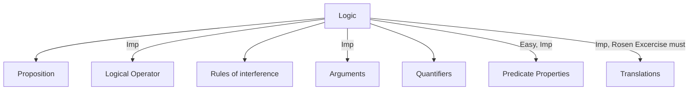

# Logics [2 Marks] Due date: :one:_-_:seven: Nov 2023

[YT Playlist](https://www.youtube.com/playlist?list=PLC36xJgs4dxF5fTaOmUjEJJS8PMnbgO_Y)

Total Videos  :six::six:

Daily videos :one::zero: 🔥

## :one: [YT NovDay1][LOGIC_NOV_DAY1_YT_LINK]



### Propositions

A declarative statement which is `either true or false` but `not both`.

- ✅ `Declarative and Factual Information`
- ✅ Moon is made of cheese [trueth value = false]
- ✅ Amit is tall. [`First person is perposition`]
- ❌ He is tall. [`third person is not perposition`]
- ✅ 2 + 5 = 10 [`truth value = false`]
- ❌ x + y = 5 [`truth value = flase/true`]
- ❌ exclamatory, command, question marks are not perpositions
- ❌ This sentance is true [`truth value = false/true`]
- ❌ `Paradox` => contradictory

❌ Liar Paradox : I am Laying

- ❌ This sentence is false

  ```mermaid
    graph TD
    T[True] --> F[false];
    F --> T;
  ```

#### `Note - At finite time truth value should be fixed`

#### Questions

1. 4 is prime number ✅
2. I have time & I will go to town ✅
3. Tomorrow it will rain ✅
4. Tomorrow it may rain ❌
5. I don't exist ❌ => Liar Paradox
6. Grass is green. ✅
7. Everything is plant or animal ✅
8. my name is amit ✅
9. This board is white ✅
10. This is a book ✅

## :two: [YT NovDay2][LOGIC_NOV_DAY2_YT_LINK]

## :three: [YT NovDay3][LOGIC_NOV_DAY3_YT_LINK]

## :four: [YT NovDay4][LOGIC_NOV_DAY4_YT_LINK]

## :five: [YT NovDay5][LOGIC_NOV_DAY5_YT_LINK]

## :six: [YT NovDay6][LOGIC_NOV_DAY6_YT_LINK]

## :seven: Revise

[LOGIC_NOV_DAY1_YT_LINK]: https://www.youtube.com/playlist?list=PLddhX2WE7PoC4ZYT5-1x3SdgZL6G6jf2s
[LOGIC_NOV_DAY2_YT_LINK]: https://www.youtube.com/playlist?list=PLddhX2WE7PoDJOqcHsE4TGBgIhq2uArpv
[LOGIC_NOV_DAY3_YT_LINK]: https://www.youtube.com/playlist?list=PLddhX2WE7PoDiLpA_rZguyp0psnjpwgMo
[LOGIC_NOV_DAY4_YT_LINK]: https://www.youtube.com/playlist?list=PLddhX2WE7PoDXJC2yBzjRY0ig3zMyAWDB
[LOGIC_NOV_DAY5_YT_LINK]: https://www.youtube.com/playlist?list=PLddhX2WE7PoCScZslkJUltiDYiQ8y5oGP
[LOGIC_NOV_DAY6_YT_LINK]: https://www.youtube.com/playlist?list=PLddhX2WE7PoDcsefe9FxKUARTAnqGdRSX
