# Logics [2 Marks] Due date: :one:_-_:seven: Nov 2023

[YT Playlist](https://www.youtube.com/playlist?list=PLC36xJgs4dxF5fTaOmUjEJJS8PMnbgO_Y)

Total Videos  :six::six:

Daily videos :one::zero: 🔥

## :one: [YT NovDay1][LOGIC_NOV_DAY1_YT_LINK]


### Propositions

A declarative statement which is `either true or false` but `not both`.

- ✅ `Declarative and Factual Information`
- ✅ Moon is made of cheese [trueth value = false]
- ✅ Amit is tall. [`First person is perposition`]
- ❌ He is tall. [`third person is not perposition`]
- ✅ 2 + 5 = 10 [`truth value = false`]
- ❌ x + y = 5 [`truth value = flase/true`]
- ❌ exclamatory, command, question marks are not perpositions
- ❌ This sentance is true [`truth value = false/true`]
- ❌ `Paradox` => contradictory

❌ Liar Paradox : I am Laying

- ❌ This sentence is false

  ```mermaid
    graph TD
    T[True] --> F[false];
    F --> T;
  ```

#### `Note - At finite time truth value should be fixed`

#### Questions

1. 4 is prime number ✅
2. I have time & I will go to town ✅
3. Tomorrow it will rain ✅
4. Tomorrow it may rain ❌
5. I don't exist ❌ => Liar Paradox
6. Grass is green. ✅
7. Everything is plant or animal ✅
8. my name is amit ✅
9. This board is white ✅
10. This is a book ✅

### Logical Operators OR connectives

Logical or Propositional Variable

- P : I have time.
- Q : I will go to market.  

Here P & Q are Logical/Propositional variable which store propositional statement.

#### Operators Type

```mermaid
  graph TD;
  O[operators] --> |^, ∨, ~| P[Primary];
  O -->  |&uarr;, &darr;, &rarr;, &harr;, ⊕| S[Secondray];
```



#### Properties of basic or fundamental Operators

|Name|Boolean Algebra(0, 1)|Set Theory(Φ,U)|Logic(False, True)
|:--:|:--:|:--:|:--:|
|OR|+|∪|∨|
|AND|.|∩|^|
|NOT|A', Ā|A', Ā, A<sup>c</sup>|~A|

##### Truth table

Logic True &rarr; T; False &rarr; F
|A|B|A^B|A∨B|~A|
|:--:|:--:|:--:|:--:|:--:|
|F|F|F|F :fire:|T|
|F|T|F|T|T|
|T|F|F|T|F|
|T|T|T :fire:|T|F|

Boolean Theory :  F &rarr; 0; T &rarr; 1
|A|B|A^B|A∨B|~A|
|:--:|:--:|:--:|:--:|:--:|
|0|0|0|0 :fire:|1|
|0|1|0|1|1|
|1|0|0|1|0|
|1|1|1 :fire:|1|0|

Set Theory : F &rarr; Φ ; T &rarr; U
|A|B|A^B|A∨B|~A|
|:--:|:--:|:--:|:--:|:--:|
|Φ|Φ|Φ|Φ :fire:|U|
|Φ|U|Φ|U|U|
|U|Φ|Φ|U|Φ|
|U|U|U :fire:|U|Φ|

##### Properties

1. Commutative
    `A.B = A.B`
    `A+B = B+A`
2. Associative
   `A+(B+C) = (A+B)+C`
   `A.(B.C) = (A.B).C`
3. Distributive
  `A+(B.C) = (A+B).(A+C)`
  `A.(B+C) = (A.B)+(A.C)`
4. Indentity
   `A+0=A`
   `A.1=A`
5. complementry
   `A+A' = 1`
   `A.A' = 0`
6. Idempotent Law
   `A+A = A`
   `A.A = A`
7. Absorbtion Law
   `A+ĀB = A + B`
   `A+AB = A`
   `A.(A+B) = A`
8. Law of double complement
   `(A')' = A`
9. Demorgan's Law
    `Change the sign break the line.`
     `(A.B)' = (A')+(B')`
10. Domination Law
    `A+1 = 1`
    `A.0 = 0`

### Derived Operators & Properties

&uarr; (NAND), &darr; (NOR), ⊕ (XOR), &harr; (XNOR), &rarr;
| P | Q | P &uarr; Q (NAND) | P &darr; Q (NOR)| P ⊕ Q (XOR)| P &harr; Q (XNOR)|P &rarr; Q|
|:--:|:--:|:--:|:--:|:--:|:--:|:--:|
F|F|T|T 🔥|F|T|T|
F|T|T|F|T 🔥|F 🔥|T |
T|F|T|F|T|F|F 🔥|
T|T|F 🔥|F|F|T|T|

#### Derived Operator Properties

- All Are commutative except &rarr;
- Associative &uarr; (NAND) and ⊕ (XOR)
  
|commutative|Associative||
|:--:|:--:|:--:|
✅|✅|⊕ (XOR), &harr; (XNOR)
✅|⛔|&uarr; (NAND), &darr; (NOR)
⛔|⛔|&rarr;

- Distributive = It can have multiple combination aprrox 42.
- P ⊕ Q = P'Q + PQ'
- P &rarr; Q = P' + Q
- ⊕ (XOR) => Diffrences
- &harr; (XNOR) => Similarity
- diffrences
  p' ⊕ Q = P &harr; Q
  p ⊕ Q' = P &harr; Q
  P' ⊕ Q' = p &harr; Q
- Similarity
   p' &harr; Q = P ⊕ Q
  p &harr; Q' = P ⊕ Q
  P' &harr; Q' = p &harr; Q

#### Derived Operator Questions

1. &rarr; is distributive over ∨ ?
2. ∨ is distributive over &rarr; ?
3. truth table is given
   |P|Q|P%Q|
   |:--:|:--:|:--:|
   |0|0|0|
   |0|1|1|
   |1|0|0|
   |1|1|1|

   `P % Q = P'Q + PQ`

## :two: [YT NovDay2][LOGIC_NOV_DAY2_YT_LINK]

## :three: [YT NovDay3][LOGIC_NOV_DAY3_YT_LINK]

## :four: [YT NovDay4][LOGIC_NOV_DAY4_YT_LINK]

## :five: [YT NovDay5][LOGIC_NOV_DAY5_YT_LINK]

## :six: [YT NovDay6][LOGIC_NOV_DAY6_YT_LINK]

## :seven: Revise

[LOGIC_NOV_DAY1_YT_LINK]: https://www.youtube.com/playlist?list=PLddhX2WE7PoC4ZYT5-1x3SdgZL6G6jf2s
[LOGIC_NOV_DAY2_YT_LINK]: https://www.youtube.com/playlist?list=PLddhX2WE7PoDJOqcHsE4TGBgIhq2uArpv
[LOGIC_NOV_DAY3_YT_LINK]: https://www.youtube.com/playlist?list=PLddhX2WE7PoDiLpA_rZguyp0psnjpwgMo
[LOGIC_NOV_DAY4_YT_LINK]: https://www.youtube.com/playlist?list=PLddhX2WE7PoDXJC2yBzjRY0ig3zMyAWDB
[LOGIC_NOV_DAY5_YT_LINK]: https://www.youtube.com/playlist?list=PLddhX2WE7PoCScZslkJUltiDYiQ8y5oGP
[LOGIC_NOV_DAY6_YT_LINK]: https://www.youtube.com/playlist?list=PLddhX2WE7PoDcsefe9FxKUARTAnqGdRSX
